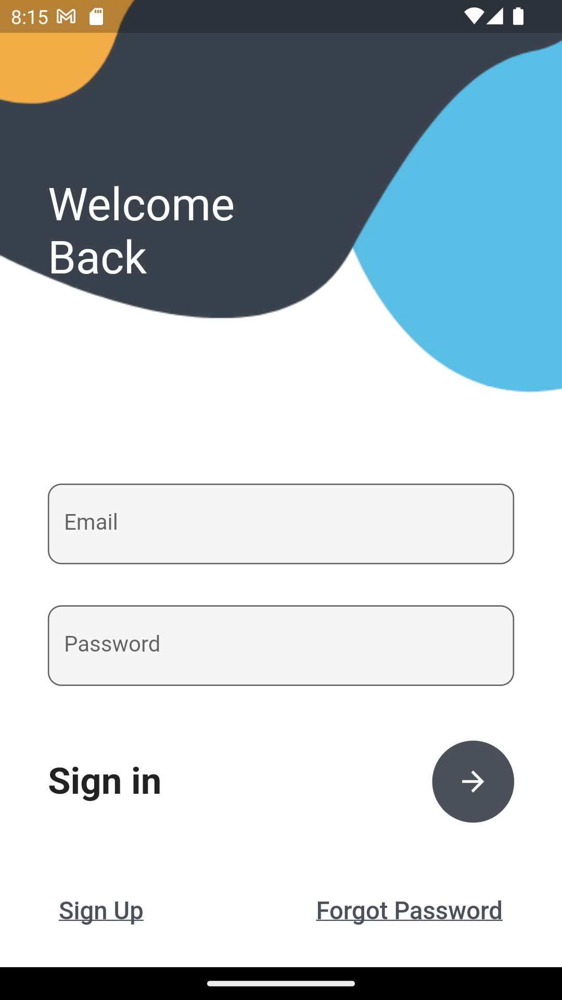
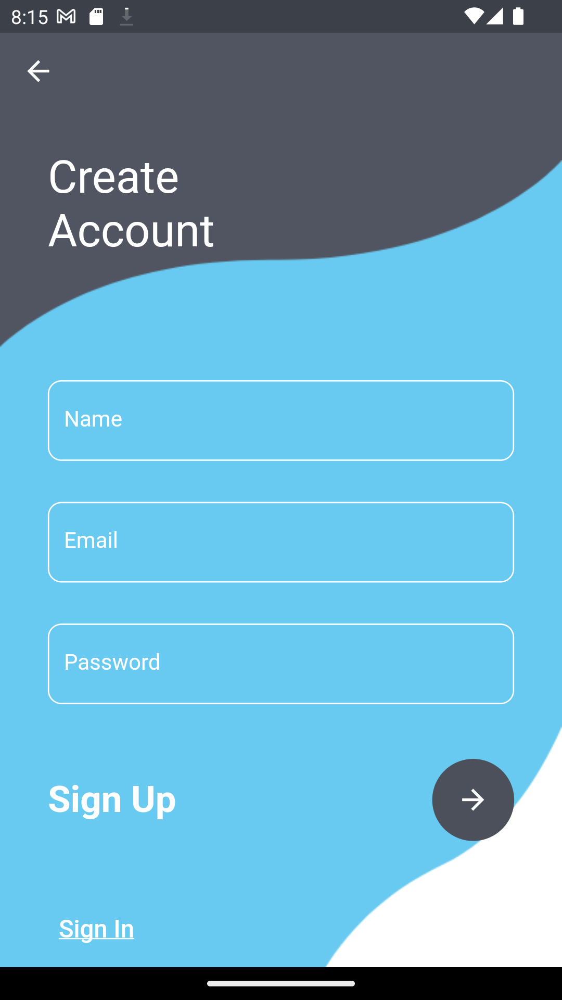

# Flutter Login Page

A simple Flutter application showcasing a basic login page UI.

## Description

This Flutter application demonstrates the implementation of a straightforward login page user interface. The UI includes input fields for username and password, along with a login button that responds to user interactions.

## Features

- Username and password input fields.
- Login button with basic interaction.
- Minimalistic and clean design.

## Screenshots

   
